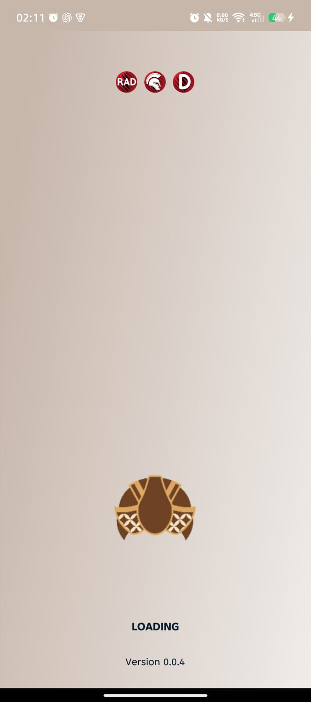
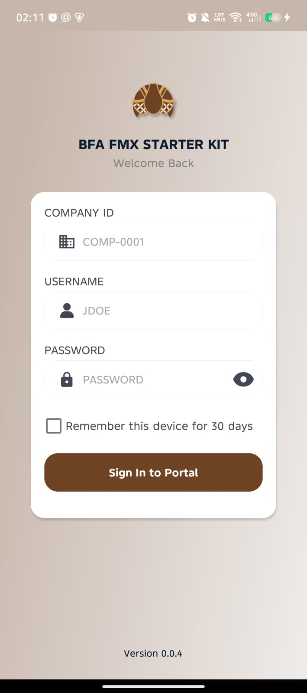
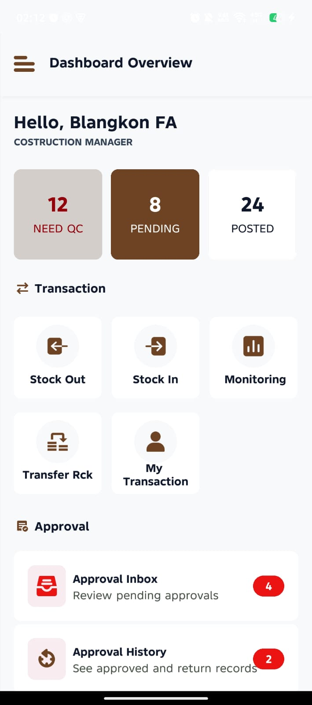
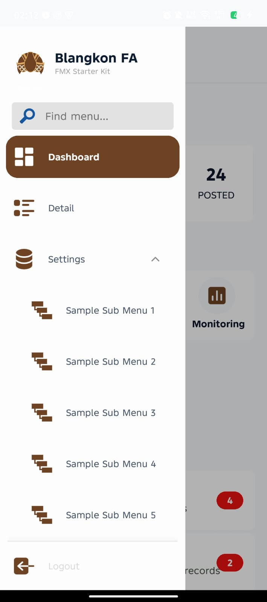
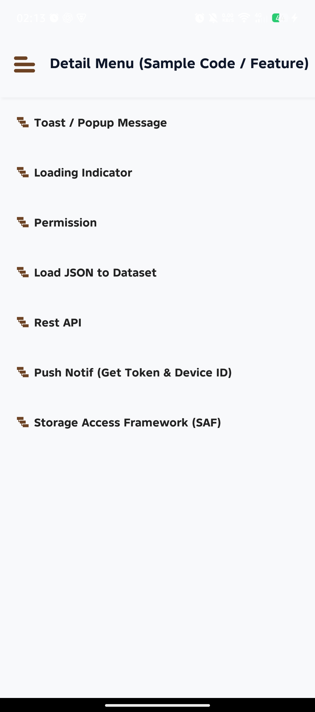

# FMX Starter Kit


English | [Bahasa Indonesia](README.id.md)

Copyright (c) 2026 Fajar Donny Bachtiar (Blangkon FA)

Build Delphi FireMonkey applications on top of a structure that is already organized for real product work.

FMX Starter Kit is a cross-platform template for Windows, Android, and iOS that uses a single form as the application shell, `TFrame` pages for screens, a centralized router for navigation, and focused services and helpers for shared behavior. Instead of starting from an empty FMX project, you begin with an opinionated base that is easier to extend, test, and maintain.

## Overview

This template is intended for teams and developers who want to move quickly without letting the project structure collapse as features grow. It already includes:

- A main application form used as the container shell.
- Frame-based page navigation with route history and back handling.
- A shared service container for application-level dependencies.
- Helper classes for common UI and platform tasks.
- Cross-platform hooks for push notifications and Storage Access Framework (SAF).
- Example screens for loading, login, and detail flows.

## Why This Template

- Start from a structured FMX foundation instead of a blank project.
- Keep navigation concerns in one place instead of scattering them across forms and frames.
- Reuse shared helpers and services as the codebase grows.
- Keep the path open for Windows, Android, and iOS from the same codebase.

## Feature Highlights

| Area | Included in Template | Why It Matters |
| --- | --- | --- |
| UI Architecture | `TForm` shell with `TFrame` pages | Keeps screens modular and easier to maintain |
| Navigation | Centralized `TFrameRouter` with history | Avoids scattered page-transition logic |
| App Bootstrap | Shared `TAppServices` container | Gives one place to initialize app-wide services |
| Mobile UX | Back-key handling, keyboard support, toast/loading helpers | Covers common FMX interaction needs early |
| Platform Access | SAF and push notification hooks | Makes Android and iOS extension points easier to reuse |
| Helper Layer | API, dataset, bitmap, URL, and file helpers | Reduces repeated boilerplate across features |

## Key Features

- `TForm` as the app shell and `TFrame` for each application page.
- Centralized navigation through `BFA.Control.Frame`.
- Back-button handling for Android hardware back key and desktop escape key.
- Shared `TAppServices` bootstrap for router, keyboard handling, toast/loading UI, push notifications, and SAF.
- Utility helpers for API requests, datasets, bitmaps, URLs, and file access.
- Memory leak reporting enabled on shutdown in the project entry point for debugging.

## Gallery

The screenshots below are taken from the current template build.

| Loading | Login |
| --- | --- |
|  |  |

| Dashboard | Sidebar |
| --- | --- |
|  |  |

| Detail Sample |
| --- |
|  |

## Architecture

The project follows a clean separation of concerns:

- `frMain.pas` is the application shell and initializes the app context.
- `frames/*` contains UI pages implemented as frames.
- `sources/app/*` contains application context, types, and service initialization.
- `sources/controls/*` contains reusable UI controllers such as frame routing, keyboard handling, messages, permissions, and notifications.
- `sources/helpers/*` contains reusable helper classes for application and platform capabilities.
- `sources/resources/*` and `sources/exceptions/*` contain shared messages and custom exception types.

The current sample flow registered by the router is:

- `LOADING`
- `LOGIN`
- `DETAIL`

## Project Structure

```text
FMXDesignTemplateAndroid/
|-- FMXStarterKit.dpr
|-- FMXStarterKit.dproj
|-- compile.bat
|-- frMain.pas
|-- frames/
|   |-- frLoading.pas
|   |-- frLogin.pas
|   |-- frDetail.pas
|   `-- ...
`-- sources/
	|-- app/
	|-- controls/
	|-- exceptions/
	|-- helpers/
	`-- resources/
```

## How Navigation Works

Navigation is managed by `TFrameRouter` in `sources/controls/BFA.Control.Frame.pas`.

- Frames are registered once with an alias.
- Navigation uses aliases such as `LOGIN` or `DETAIL`.
- Each frame can optionally expose `ShowFrame` and `BackFrame` methods.
- The router stores route history and can navigate back automatically.
- The main form forwards back-key behavior to the active frame through the router.

This keeps page transitions out of individual forms and makes the UI flow easier to maintain.

## Included Services

`TAppServices` wires together the main building blocks used by the template:

- `Router`: frame registration and navigation.
- `Keyboard`: keyboard visibility and scroll-aware input handling.
- `MainHelper`: toast messages, loading state, and popup helpers.
- `PushNotification`: mobile notification integration for Android and iOS.
- `SAF`: cross-platform file picking and document access helpers.

## Requirements

To use this project, you should have:

- Embarcadero RAD Studio / Delphi with FireMonkey support.
- A Windows development machine for local compilation.
- Android SDK/NDK setup if you plan to target Android.
- Apple tooling on macOS if you plan to target iOS.

The included `compile.bat` is configured for a local RAD Studio environment that uses:

- `rsvars.bat` from `C:\Program Files (x86)\Embarcadero\Studio\37.0\bin\rsvars.bat`
- A local repository path at `D:\Github\FMXDesignTemplateAndroid`

Adjust those paths before using the batch file on another machine.

## Getting Started

### Option 1: Open in RAD Studio

1. Open `FMXStarterKit.dproj` in RAD Studio.
2. Select the target platform you want to run.
3. Build and run the project.

### Option 2: Build from the command line

1. Update the paths in `compile.bat` to match your Delphi installation and local repository path.
2. Run:

```bat
compile.bat
```

The script builds the project in `Debug` / `Win32` using `msbuild`.

## What You Can Customize First

- Replace the sample frames with your own application pages.
- Add new route aliases in `TAppServices.InitFrame`.
- Expand the helper layer for app-specific APIs, storage, and platform integrations.
- Standardize labels and messages if your product language is English-only.

## Default Startup Behavior

When the application starts:

1. The main form creates the application context.
2. `TAppServices` is initialized.
3. Core services such as router, keyboard handling, toast/loading support, SAF, and push notifications are prepared.
4. The router opens the `LOADING` frame.

From the sample screens, you can continue into the login and detail pages to extend the template into your own app flow.

## Extending the Template

To add a new page:

1. Create a new `TFrame` unit in the `frames` folder.
2. Implement optional `ShowFrame` and `BackFrame` methods if needed.
3. Add a new view alias in `sources/app/BFA.App.Types.pas` under the `TView` constants.
4. Register the frame alias in `sources/app/BFA.App.Services.pas` class `TAppServices.InitFrame`.
5. Navigate to it through `TAppHelper.NavigateTo('YOUR_ALIAS')`.

To add shared business logic or platform behavior:

- Put UI logic in frames.
- Put application wiring in `sources/app`.
- Put reusable navigation or interaction controls in `sources/controls`.
- Put reusable non-UI logic in `sources/helpers`.

## Why Use This Template

This project is a strong starting point if you want a Delphi FMX codebase that is already organized around:

- frame-based navigation,
- reusable services,
- helper-driven cross-platform behavior,
- and a maintainable structure for scaling beyond a demo application.

## Notes

- The repository currently contains sample frames and helper infrastructure intended to be extended.
- Some labels and toast messages in the sample code still use Indonesian text, which is useful to know if you plan to standardize the app language.
- The build script is environment-specific and should be treated as a local convenience script.

## License

This project is licensed under the Apache License 2.0. See [LICENSE](LICENSE) for the full license text and [NOTICE](NOTICE) for attribution information.
